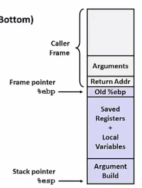

# Computer Systems: A Programmer's Perspective - System Basic Notes

## 机器码与进制转换

### 浮点数

规格化浮点数: 1.xxx * 2^(exp - 127) - e.g `5 = 5.0 = 1.25 * 2^(129 - 127)`

-   xxx: 尾数
-   exp: 阶码

### Stack Frame



```ass
# 准备阶段
# Caller-Save: %eax %ecx %edx
# Callee-Save: %ebx %esi %edi
# 传参顺序: rdi, dsi, rdx, rcx, r8, r9, stack

pushl %ebp
movl %esp, %ebp
pushl %ebx

# 结束阶段

movl -4(%ebp), %ebx
movl %ebp, %esp
popl %ebp
ret
```

`x86_64`: 可使用超出 Stack Pointer 128 bytes 的内存区域, 称为 Red Zone.

## Architecture

### Control Signal

|State|Signal|
|:---------:|:----------:|
|Fetch|icode,ifun  rA,rB  valC,valP|
|Decode|valA,srcA  valB,srcB|
|Execute|valE  Cond|
|Memory|valM  read/write|
|WriteBack|E port,dstE  M port,dstM|
|PCUpdate|PC|

### Special Control Signal

|Condition|Signal|
|:---------:|:----------:|
|handle ret| `IRET in {D_icode, E_icode, M_icode}` |
|load/use hazard| `E_icode in {IMRMOVL, IPOPL} && E_dstM in {d_srcA, d_srcB}` |
|mispredicted branch| `E_icode in {IJXX} && !e_Cnd` |
|exception| `m_stat in {SADR, SINS, SHLT} || W_stat in {SADR, SINS, SHLT}` |

### Branch/Loop/Jump

PrectPC | `W_valM`(无法预测) | `M_valP/M_valA`(在译码阶段合并信号量 valA 与 valP: PCUpdate 位于 Fetch,无需传递 valP, 只剩 call/jxxx 需要 valP)

-   AT: always taken
-   NT: never taken
-   BTFNT: backward taken forward not taken

### Forwarding

流水线中最早阶段的转发源, 优先级最高 execute > memory > write

```hcl
int d_valA = [
    D_icode in {ICALL, IJXX}: D_valP;

    d_srcA == e_dstE : e_valE;
    d_srcA == M_dstM : m_valM;
    d_srcA == M_dstE : M_valE;
    d_srcA == W_dstM : W_valM;
    d_srcA == W_dstE : W_valE;

    # register file
    1 : d_rvalA;
];
```

### Exception

流水线中最深的指令引起的异常, 优先级最高 e.g 访存阶段地址越界异常优先级高于取指阶段地址越界异常优先级

### Efficence

CPI = 1.0 + lp + mp + rp:

-   lp: load penalty(load/use hazard)
-   mp: mispredicted branch penalty
-   rp: return penalty

## Optimization

### Principles

-   合适的算法和数据结构
-   编写编译器能够有效优化的代码  e.g 寄存器别名,存储器别名,函数的副作用 导致编译器无法(不敢)合并/删除冗余代码
-   提高代码的并行性
-   消除不必要的访存 e.g 多次访存(可用中间量优化), 多次函数调用(可用宏/内联函数优化)

### Tips

#### Replacement

-   用多条 Shift/Add/Sub 指令, 代替 Mul/Div

#### Branch

-   利用条件表达式代替条件分支语句: 降低预测错误惩罚

#### Code Motion

-   将不变测试条件/常变量的计算从循环中移出
-   将多次访存利用中间自动/寄存器变量改写成一次访存

#### Unrolling (Duff's Device)

循环展开: 增大循环的步长 - Duff's Device 以 7 为步长:

-   提升循环的运行效率
-   一次循环内: 可先将所有数据先读出来(Memory State),将进行计算(Excute State), 从而消除 Load/Use 冒险而产生的 Bubble

## 异常控制流

理解异常控制流,有助于理解以下概念:

-   陷阱(trap)/系统调用(system call)
-   系统级I/O
-   线程/进程(concurrency)
-   虚拟存储器
-   软件异常

### 异常

#### 分类

|类别|原因|异步/同步|返回行为|例子|
|:------:|:----------:|:-----:|:----------:|:---------:|
|中断(interrupt)|I/O|async|next(concurrency)|磁盘|
|陷阱(trap)|有意的异常/系统调用(内核模式)|sync|next|read/write/intN|
|故障(fault)|潜在可恢复的错误|sync|possible current/abort(not return)|segmentation fault/floating exception|
|终止(abort)|不可恢复的错误|sync|abort(not return)|硬件错误|

#### 异常处理程序

异常处理程序主要分为3类:

-    控制权返回给 Instruction_current
-    控制权返回给 Instruction_next
-    abort/exit
