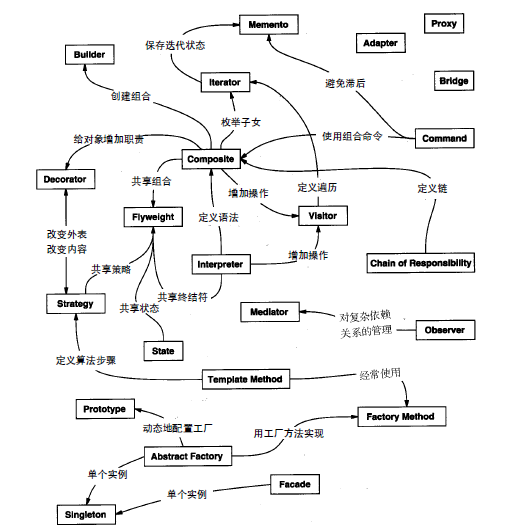

## Prototype
关键方法clone()
## Bridge
分离抽象和实现/分离对象的两种不同属性

e.g 从2个不同维度上扩展对象
## Composite
树形结构  
- 根结点
  - Component抽象对象/接口 采用最大宽接口,定义内点和叶点的操作
  - 将内点特有的操作集设为缺省操作集(空实现)
- 内点
  - 持有父结点和子节点的引用(可使用Flyweight模式实现共享)
  - 操作集:内点操作集(可添加/删除组件)
- 叶点 
  - 持有父结点引用
  - 操作集：叶点操作集(不可添加/删除组件)
## Adapter
改变接口
## Decorator
保持接口的一致性，动态改变对象的外观/职责
- ConcreteDecorator类

private ClassName component;(拥有一个对象引用)
## Strategy
改变对象的内核/算法
## Facade
封装复杂的子系统
## Flyweight
减小内存开销
- 共享大量对象的内部状态——对象实例相似处
- 外部状态作为方法参数:使之适应不同的外部状态(context)——对象实例差异处

## Strategy
一个Strategy对象封装一个算法
## State
一个State对象封装一个与状态相关的行为
## Mediator
一个Mediator对象封装对象间的协议
## Iterator
一个Iterator对象封装访问和遍历一个聚集对象中的各个构件的方法
